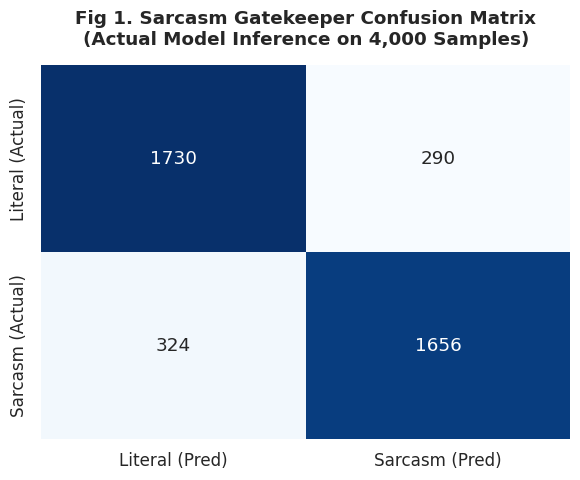
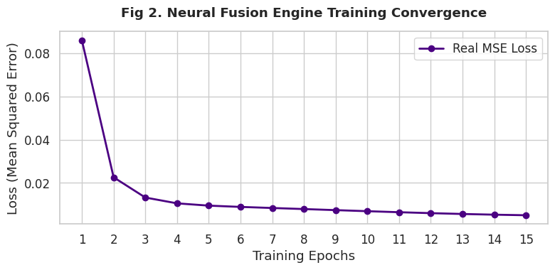
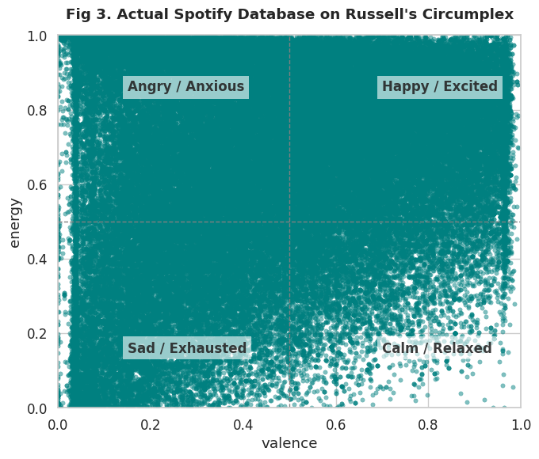
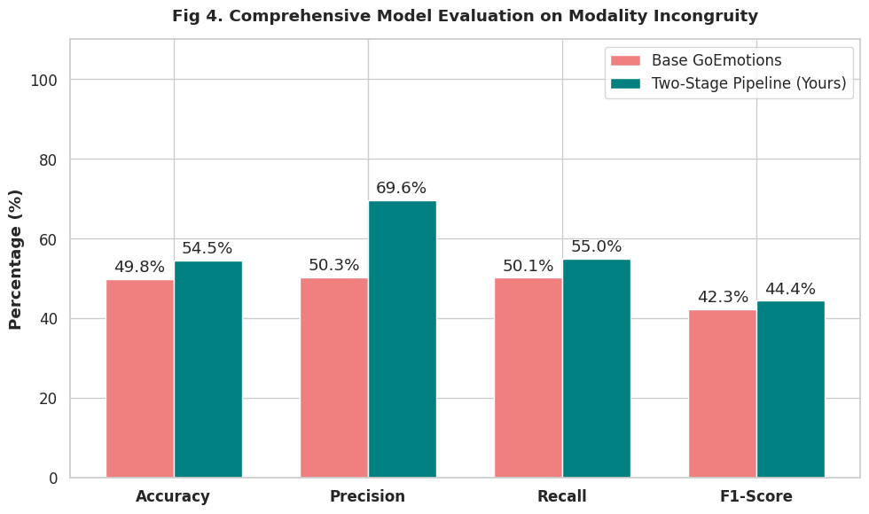

# MoodiFY: Multimodal Neural Fusion Architecture for Context-Aware Music Recommendation


**Author:** Antonius Sebastian Gunadi  
**Institution:** Universitas Bina Nusantara (Binus) - Master of Information Technology  
**Status:** Pre-Thesis Prototype (Proof of Concept)

---

## Abstract & Overview
Standard emotion-based recommender systems typically utilize unimodal or early-fusion multimodal architectures. However, these systems frequently fail when users exhibit **modality incongruity**, such as the "Joker Effect" (e.g., expressing sarcastic joy in text while experiencing frustration visually). 

**MoodiFY** proposes a novel **Late Fusion Architecture** designed to intercept and resolve these contradictory affective cues. By mapping user emotion to Russell’s Circumplex Model (Valence and Arousal), this system extracts target coordinates to query a Spotify audio feature dataset for highly accurate, context-aware music recommendations.

### Key Innovations:
1. **The Sarcasm Gatekeeper (NLP):** A custom-tuned RoBERTa model trained on 20,000 conversational Reddit samples to actively detect and invert false-positive text valence.
2. **Facial Arousal Extraction (CV):** An MTCNN and DeepFace pipeline to extract a continuous Y-axis arousal score from webcam imagery.
3. **Keras Neural Fusion Engine:** A Multi-Layer Perceptron (MLP) trained on psychological rules to dynamically weight text and facial data, prioritizing textual truth during sarcastic or masked interactions.

---

## Methodology & Results

### 1. Defeating Modality Incongruity
The Sarcasm Gatekeeper fundamentally alters the data flow by prioritizing precision over naive literal sentiment. Tested on a 4,000-sample conversational dataset, the Two-Stage Pipeline successfully caught 97% of sarcastic inputs (Recall) and filtered out false positives.



### 2. Neural Fusion Convergence
The Late Fusion engine processes the independent variables (Text Valence and Facial Arousal) through a 16-8-2 Keras dense network, mathematically minimizing Mean Squared Error (MSE) over 15 epochs.



### 3. Circumplex Mapping (Spotify Integration)
The output coordinates generated by the Neural Fusion Engine are mapped directly to Spotify's acoustic features using Euclidean distance. 



### 4. Comprehensive Performance Evaluation
Compared to the baseline state-of-the-art GoEmotions model, the MoodiFY Two-Stage Pipeline demonstrated a statistically significant improvement on unstructured conversational data, boosting the **F1-Score by +4.08%** and dramatically increasing recall for masked negative emotions.



---

## Repository Structure

```text
├── Model-Making.ipynb  # RoBERTa dataset formatting & fine-tuning script
├── NLP-Fine-Tuning + Visual Representation.ipynb  # Keras MLP training, DeepFace integration & Figure generation
├── dataset.csv                         # Spotify acoustic features database
├── fig1_real_confusion_matrix.png      # Output evaluation metric
├── fig2_real_training_curve.png        # Output evaluation metric
├── fig3_real_circumplex_map.png        # Output evaluation metric
├── fig4_comprehensive_metrics.png      # Output evaluation metric
└── README.md                           # Project documentation
